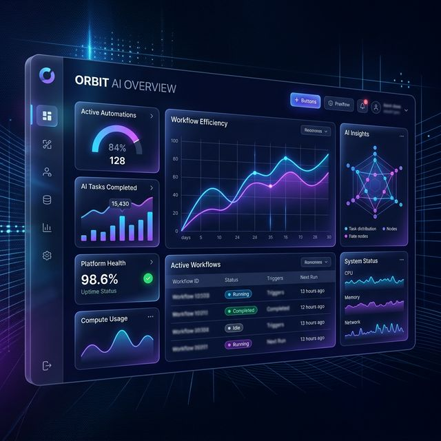

# Orbit - AI-Powered Automation Landing Page



Orbit is a premium, high-converting landing page template designed for AI SaaS platforms, automation tools, and data-driven startups. Built with **React 19**, **Vite**, and **Tailwind CSS**, it features cutting-edge aesthetics, smooth **Framer Motion** animations, and a fully responsive layout.

## ✨ Key Features

- **🎯 High-Conversion Hero Section**: Features dynamic text, glassmorphism UI elements, and a stunning dashboard preview.
- **⚡ Performance Optimized**: Built with Vite for near-instant load times and high Lighthouse scores.
- **📱 Fully Responsive**: Seemless experience across mobile, tablet, and desktop devices.
- **🎨 Modern Aesthetic**: Dark mode design with vibrant accent colors, deep glows, and professional typography.
- **🧩 Component-Based Architecture**: Highly modular code using clean React components for easy customization.
- **Animations & Micro-interactions**: Powered by Framer Motion and Lucide icons for a premium 'alive' feel.
- **📧 Lead Generation Ready**: Integrated waitlist section with active form validation and success states.

## 🛠️ Tech Stack

- **Framework**: React 19
- **Build Tool**: Vite 8
- **Styling**: Tailwind CSS 3.4
- **Animations**: Framer Motion 12
- **Icons**: Lucide React
- **Design Pattern**: Glassmorphism & Modern Dark UI

## 📦 Getting Started

1. **Install Dependencies**:
   ```bash
   npm install
   ```

2. **Run Development Server**:
   ```bash
   npm run dev
   ```

3. **Build for Production**:
   ```bash
   npm run build
   ```

## 📂 Project Structure

- `src/components`: Individual UI sections (Hero, Features, Pricing, etc.)
- `src/assets`: Images, logos, and global design assets.
- `src/App.jsx`: Main application layout and section ordering.
- `tailwind.config.js`: Custom color palette and design tokens for Orbit.

## 🚀 Deployment

This project is ready for one-click deployment on platforms like:
- **Vercel**
- **Netlify**
- **GitHub Pages** (via GH Actions)

---

Developed with ❤️ for high-growth teams.
